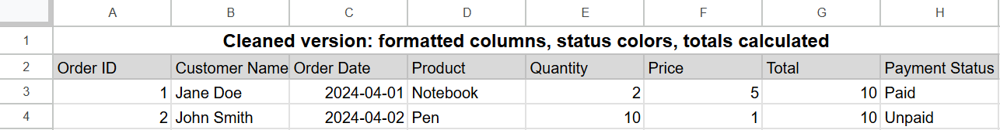

# 📊 Google Sheets Order Tracker

A structured multi-tab spreadsheet system for tracking customer orders, payments, and fulfillment.

## ✅ Features

- Auto-calculated totals (Quantity × Price)
- Dropdowns for Payment Status
- Conditional formatting (Paid / Unpaid)
- Client-facing layout

## ▶️ How to Run

```bash
python order_tracker.py
```

## 📁 Files

- sample_data.csv
- order_tracker.py
- order_summary_cleaned.csv
- example.png (UI preview)

## 📸 Preview

